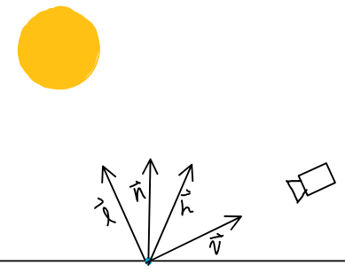

# Introduction
In an attempt to allow for greater artist control and graphical quality within Basilisk Engine, we decided to pursue an implamentation of pricipled shading. In particular, the model is based on the model presented in Burley's 2012 paper, [Physically Based Shading at Disney](https://media.disneyanimation.com/uploads/production/publication_asset/48/asset/s2012_pbs_disney_brdf_notes_v3.pdf). Burley also released another paper in 2015, [Extending the Disney BRDF to a BSDF with Integrated Subsurface Scattering](https://blog.selfshadow.com/publications/s2015-shading-course/burley/s2015_pbs_disney_bsdf_notes.pdf) which extened the BRDF in the previous model to a BSDF for subsurface scattering. Because the original model includes an approximation for subsurface scattering, we decided not to used the extended version to perserve performance. In addition to this model, we also analyzed the principled shading model [implemented](https://github.com/blender/blender/blob/main/source/blender/gpu/shaders/material/gpu_shader_material_principled.glsl) by Blender. Their [Principled BSDF](https://docs.blender.org/manual/en/latest/render/shader_nodes/shader/principled.html), though a BSDF, was a great tool for seeing what the result of a principled model should look like.

# Rendering Equation
The [rendering equation](https://en.wikipedia.org/wiki/Rendering_equation), introduced in 1986 by [David Immel et al.](http://www0.cs.ucl.ac.uk/research/vr/Projects/VLF/vlfpapers/multi-pass_hybrid/Immel_D_S__A_Radiosity_Method_for_Non-Diffuse_Environments.pdf) and [James Kajiya](https://www.cse.chalmers.se/edu/year/2011/course/TDA361/2007/rend_eq.pdf), is the basis for physically based rendering. In general, the modern rendering equation (omitting time) is of the form:

$$L_o(x,\vec l,\lambda) = L_e(x,\vec l,\lambda) + L_r(x,\vec l,\lambda)$$
$$L_r(x,\vec l,\lambda) = \int_{\Omega}f_r(x,\vec v,\vec l,\lambda)L_i(x,\vec v,\lambda)(\vec v\cdot \vec n)d\vec v$$

Where $L_e$ is the emitted light and $L_r$ is the reflected light.

## Terms
It is helpful to establish a number of terms a vectors that will be used in coming sections.

Where:
- $\vec n$ is the surface normal
- $\vec l$ is the light vector
- $\vec v$ is the view vector
- $\vec h$ is the half vector between $\vec l$ and $\vec v$

Additionally, the following angles between vectors will be used:
- $\theta_l$ is the angle between $\vec n$ and $\vec l$
- $\theta_v$ is the angle between $\vec n$ and $\vec v$
- $\theta_h$ is the angle between $\vec n$ and $\vec h$
- $\theta_d$ is the angle between $\vec l$ and $\vec h$ or (by symmetry) the angle between $\vec v$ and $\vec h$

## $L_e$ : Emitted Light
For out model, we use a simple additive constant for the material emission. Many surfaces do not have emissive properties, and for those that do, the simple addition is more than sufficient.

## $L_r$ : Reflected Light
There are three terms that contribute to the reflected light the weakening factor, the bidirectional reflectance distribution function (BRDF), and the spectral radiance. We will examine each of these individually. 

### Weakening Factor
The weakening factor reduces the irradices of a surface at grazing angles. It is this factor alone that creates the Lambertian Diffuse model. This model takes into account the observation that surfaces exhibit full reflectance when the surface normal is point directly at the light ($\theta_i=0$) and no reflectance when the the light is at or below the surface ($\theta_i \ge 90$). Conviently, a function exists that gives $1$ when $\theta=0$ and $0$ when $\theta=90$, namely the $cos$ function. Thus, the weakening factor is commonly expressed as:

$$cos\theta_i$$

Where $\theta_i$ is the angle between the surface normal and the light direction. Since we have the normal and direction vectors as unit vectors, $cos\theta_i$ is equivalent to the dot product between the two vectors, since their magnitude's are $1$. Thus our weakening factor is expressed as:

$$\vec\omega_i\cdot \vec n$$

### Principled BRDF
